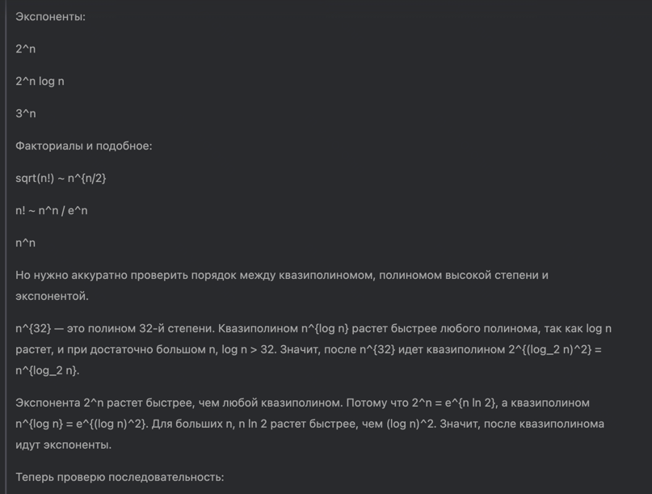

1. \( 2^{100} \)
2. \( \sqrt{n} \)
3. \( 2^{\log_3 n} \)
4. \( \frac{n}{\log n} \)
5. \( n \)
6. \( n \log n \)
7. \( \log(n!) \)
8. \( n^{32} \)
9. \( 2^{\log_2^2 n} \)
10. \( 2^n \)
11. \( 2^n \log_2 n \)
12. \( 3^n \)
13. \( \sqrt{n!} \)
14. \( n! \)
15. \( n^n \)

**Пояснение:**  
Функции упорядочены от самой медленно растущей к самой быстро растущей. Константа \( 2^{100} \) растет медленнее всех.
Далее следуют полиномиальные функции с возрастающими степенями (\( \sqrt{n} \), \( 2^{\log_3 n} \), \( \frac{n}{\log
n} \), \( n \), \( n \log n \)), затем квазиполиномиальная \( 2^{\log_2^2 n} \), экспоненциальные (\( 2^n \), \( 2^n
\log_2 n \), \( 3^n \)) и, наконец, факториальные и суперэкспоненциальные функции (\( \sqrt{n!} \), \( n! \), \(
n^n \)).

