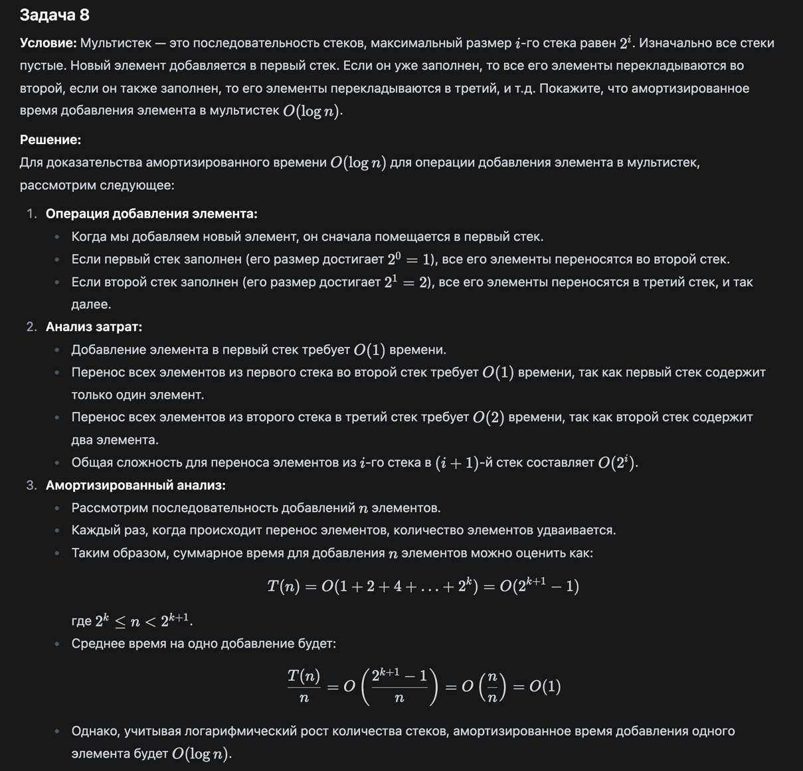

Задача 8
Условие: Мультистек — это последовательность стеков, максимальный размер i-го стека равен 2^i .
Изначально все стеки пустые. Новый элемент добавляется в первый стек. Если он уже заполнен, то все его элементы
перекладываются во второй, если он также заполнен, то его элементы перекладываются в третий, и т.д. Покажите, что
амортизированное время добавления элемента в мультистек O(logn).

